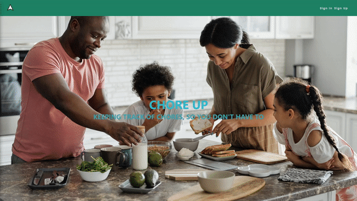

# Chore Up

When it comes to young and small children, exposing them to responsibility is important, but not necessarily the easiest thing to do. Chore Up aims to gamify doing chores  to make doing chores seem more interesting and to teach them that they will be held accountable. By marking a chore as done, the child is communicating that they have  
the task at hand and helps to build trust between the child and the parent. Should the child have lied about completion it is up to the parent to decide what the appropriate  
couse of action is considering the child has now not only lied but also disregarded their responsibility.

This is the front-end client of the app. You can view it live [here](https://chore-up-client.vercel.app/)!

To check out the app, you can create your account and make a family or join the dummy family provided. There you can either create chores or mark chores as done.

#### Dummy Admin Account Info
- Email: john-doe@test.com
- Password: aB3!bnmv
- Dummy Family Code: f3Zg5wq2

#### Dummy User Account Info
- Email: jake-doe@test.com
- Password: aB3!bnmv

### New Admin Demo

### New Regular User Demo

### Returning Admin Demo

### Returning Regular User Demo

### Technology Used
- React
  - Create React App
  - React Router
- HTML 5
- CSS
- Vercel

### Back-end
This client should be used in conjunction with the API made for this project which can be found [here](https://github.com/Human437/chore-up-api).